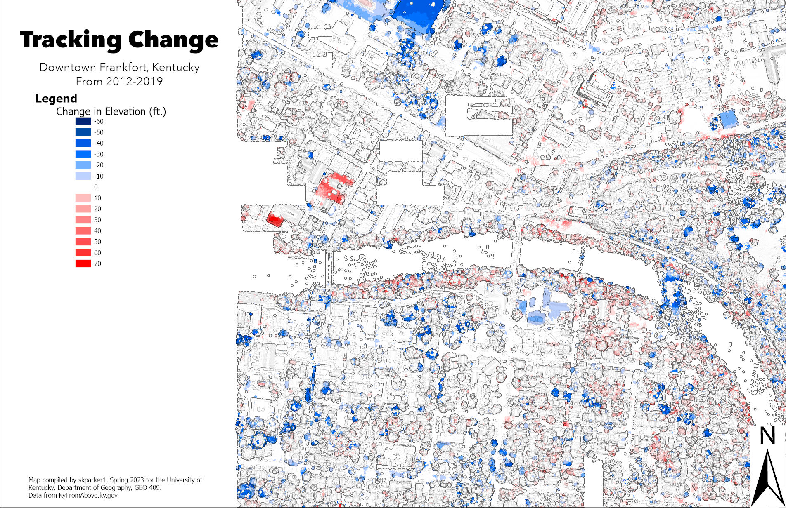

# Downtown Frankfort, Kentucky
## Change in elevation from 2012 to 2019

There was not much change in downtown Frankfort between the years of 2012 and 2019. The most noticiible change is the demolition of the Civic Center. Also you can see a few structres have been built, such as the new court house. Finally you are able to see there is some change in the canopy cover.

     
*A map showing the change in elevation in Downtown Frankfort, Kentucky*

[Link to high-resolution version](hi-res.pdf)     

Map compiled by skparker1, Spring 2023 for the University of Kentucky, Department of Geography, GEO 409.
Data from KyFromAbove.ky.gov